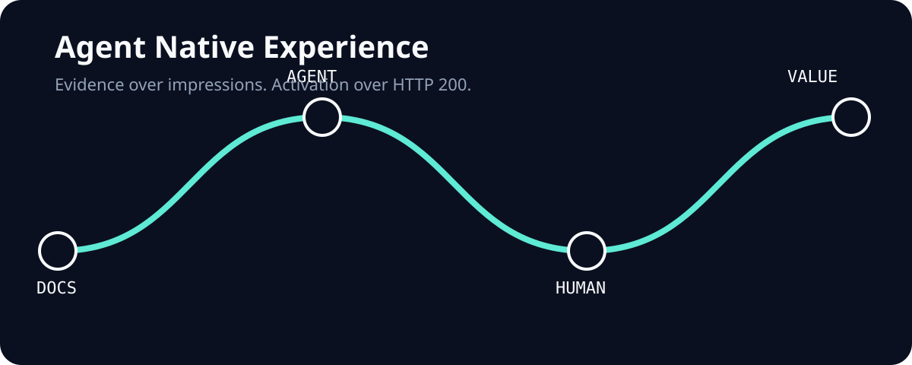

# Apostl Skills

[](https://skills.sh/apostl-dev/apostl-skills)

<p align="center">
  
</p>

Find broken SDK quickstarts before they leak developer activation.

Apostl skills turn release-readiness work into local, inspectable agent workflows: clean environments, exact commands, real stdout/stderr, source snapshots, and reports a DevRel, SDK, product, or partner engineering team can act on.

Start with a free local pass. The skill runs the documented path from a clean workspace, captures command-level proof, and turns first-run failures into a compact activation-risk report.

## Install

List available skills:

```bash
npx skills add apostl-dev/apostl-skills --list
```

Install the SDK onboarding audit skill:

```bash
npx skills add apostl-dev/apostl-skills --skill sdk-onboarding-audit -g -y
```

Then ask your agent:

```text
Run a clean-env onboarding audit for this SDK launch. Test the documented quickstart first and give me command-level findings.
```

## Available Skills

### [agent-native-experience](skills/agent-native-experience)

<p align="center">
  
</p>

An evidence-backed audit of how well a product and its documentation work for
agents, from discovery through an observable first-value event. It combines
AFDocs-compatible documentation checks, product/API criteria, a clean-room
agent journey, explicitly separate human evidence, honest full-corpus
accounting, and editable RICE priorities.

Install it from this monorepo:

```bash
npx skills add apostl-dev/apostl-skills --skill agent-native-experience -g -y
```

Then ask your agent:

```text
Use $agent-native-experience to audit this product's documented quickstart,
identify the first faithful blocker, and give me a 30/60/90 improvement plan.
```

The local audit needs no Apostl account and makes no Apostl mutation calls. It
produces a deterministic Markdown and JSON report and keeps missing evidence as
`unknown` or `not_run`. Local file fixes require their own ordinary approval;
they do not authorize uploads, agent runs, steps, or feedback. Platform mode is
optional and starts only when the user asks for an Apostl authorization link.

The report includes:

- executive verdict, selected journey, activation event, and environment;
- weighted Docs/Product/Agent/Human score with rubric version;
- command-level agent friction and separately sourced human friction;
- frozen corpus counts, exclusions, source provenance, and limitations;
- review-ready fixes, visible RICE assumptions, and a 30/60/90 plan.

Hero artwork is generated locally and contains no tracking:

```bash
python3 skills/agent-native-experience/scripts/generate_hero.py
```

#### First audit in 60 seconds

1. Install the skill with the command above.
2. Give your agent the docs URL, the documented journey, and the observable
   activation event. A fetch or HTTP 200 is not an activation event.
3. Start with local/sample mode. Review `report.md` and `report.json`; no Apostl
   account or customer credential is required.

Run the self-contained bounded collector when AFDocs is unavailable:

```bash
python3 skills/agent-native-experience/scripts/collect_evidence.py \
  --url https://www.w3schools.com/html/html_intro.asp \
  --journey "Reproduce the introductory HTML example locally" \
  --activation-event "The documented heading and paragraph are visible" \
  --mode sample \
  --output-dir .tmp/agent-native-w3schools
```

The command writes `raw-evidence.json`, `evidence.json`, `report.md`, and
`report.json`. It uses only the Python standard library, performs GET-only
public-doc checks, rejects URL userinfo and every query string, validates public
DNS, connects directly to the validated numeric IP while preserving the HTTP
Host and HTTPS certificate hostname, disables environment proxies, and enforces
request, redirect, response-size, timeout, and page limits. The same URL rules
apply to redirects and discovered corpus links. Raw response bodies are not
persisted. Static collection does not prove activation; enrich `evidence.json`
with the real agent trace and rerun `audit.py` after executing the selected
journey.

#### W3Schools clean-room browser proof

The collector command above is deliberately not browser activation proof. For
the separately executed independent fixture, use
`https://www.w3schools.com/html/html_intro.asp`, reproduce its pinned
introductory HTML in a fresh local directory, then use `agent-browser` with a
fresh profile to observe the rendered H1 `This is a heading` and paragraph
`This is a paragraph.`. Begin the browser workflow with `agent-browser skills
get core`; record only the clean-room identity, ordered actions/deviations,
timestamps, observed text, and sanitized snapshot/screenshot references.

The checked-in fixture is a non-network validator, not a browser-run claim:

```bash
python3 skills/agent-native-experience/scripts/execute_cleanroom.py \
  --w3schools-fixture-dir skills/agent-native-experience/tests/fixtures/w3schools-clean-room
```

It rejects source/local-index/trace/browser-DOM mismatches and static-only
evidence. It does not open a browser, persist a profile, or run automatically
during installation.

Inputs are the target URL, selected journey, activation event, and environment.
Optional inputs include a repository or OpenAPI spec, frozen corpus inventory,
human observations, and business metrics. Business observations use the
versioned `agent-native-business-evidence.v1` schema with separate market,
competitor, and buyer source records; each record needs provenance, UTC
observation and expiry times within a 30-day window, type, claim kind,
confidence/status, and validation owner or next owner.
Missing, stale, malformed, or unverified records remain `unknown`/`not_run`
and do not earn score credit. Outputs include the report, normalized
check results, corpus counts and hashes, source provenance, friction taxonomy,
editable RICE assumptions, and the proposed 30/60/90 plan.

The score is `40% Docs + 30% Product + 20% Agent Journey + 10% Human Journey`.
Missing evidence earns no credit, `not_applicable` is removed from the relevant
denominator, and a nominal 100 is capped at 99 unless every required criterion
and both journeys pass through the declared activation event.

Example verdict:

```text
Status: blocked
Selected journey: Install the SDK and render the documented example
First faithful blocker: The package name in the quickstart does not resolve
Coverage: 12 eligible / 12 attempted / 1 failed / 0 not_run
Next action: Correct the install command, then rerun in a fresh directory
```

#### Optional Apostl-powered proof

Start platform mode with an Apostl-owned link:

```bash
python3 skills/agent-native-experience/scripts/apostl_client.py authorize \
  --agent-name "Codex local agent" --device-name "Codex local agent" \
  --source-url https://example.com/docs \
  --journey-url https://example.com/docs/quickstart \
  --expected-activation "Rendered result is visible" \
  --run-mode external_strict
python3 skills/agent-native-experience/scripts/apostl_client.py \
  wait-authorization --max-wait-seconds 900
```

The first command prints only an Apostl verification URL and expiry. The human
opens it and registers or signs in with email, GitHub, or Google on Apostl,
reviews the requesting skill/device, scopes, workspace, intended journey,
feedback behavior, and expiry, then approves or denies. The polling command
talks only to Apostl, obeys `Retry-After` and a hard deadline, and stores the
one-time API key at `~/.config/apostl/credentials.json` with mode `0600` without
printing it. Email plus code is deprecated fallback-only behavior.

Approval connects the skill and exposes identity, scope, workspace, and the
existing exactly-once 100-step first-proof grant. It does not authorize a run.
The skill still previews the exact Project/Journey Check, step impact, URLs,
and idempotency keys and asks for explicit confirmation before deploy/run.
Apostl owns run tracking plus public HTML, Markdown, events, proof manifest,
and PDF URLs.

Feedback follows the same boundary: `feedback-preview` is local;
`feedback-submit` requires `--confirm` and an idempotency key; `feedback-list`
is a scoped read with a maximum page size of 50 and an optional nonnegative
integer cursor. The client accepts only a small structured payload and never
uploads local files, diffs, transcripts, or diagnostics.

GitHub is source distribution only. Authorization, runs, tracking, and feedback
go through Apostl. The production runner image and registry stay inside the
Apostl production perimeter; public GHCR is not a launch dependency.

Privacy rules are strict: do not supply customer secrets in target fields; codes,
keys, tokens, cookies, email contents, and environment values are excluded from
reports. Unexecuted work stays visible. A sampled run cannot claim full corpus
coverage, a workaround remains friction, and a provider or sandbox blocker is
reported rather than waived.

Human and full-corpus proof are also separate from static checks: a human pass
requires an accountable owner, journey/version, observation time, activation
evidence reference, and responsible next action. Full documentation covered is
possible only when every frozen eligible guide has an owned terminal row with
source and content hash; blocked, sampled, or unowned rows keep it false.

The skill format works with agents supported by the open `skills` CLI, including
Codex and Claude Code. Product-specific runtime behavior still depends on the
agent's available shell/browser tools and network policy.

Test the package locally:

```bash
npm run test:agent-native
python3 /path/to/skill-creator/scripts/quick_validate.py skills/agent-native-experience
```

Contributions follow [CONTRIBUTING.md](CONTRIBUTING.md); report sensitive issues
through [SECURITY.md](SECURITY.md). See [Apostl](https://apostl.dev), the
[platform](https://platform.apostl.dev), and the
[Agent API contract](skills/agent-native-experience/references/apostl-api.md).
See an [example public report](https://platform.apostl.dev/reports/0d071cf7-e23c-4074-8a42-b46e748a8faa)
with signed-out HTML, Markdown, events, proof manifest, artifacts, and PDF.

### [sdk-onboarding-audit](skills/sdk-onboarding-audit)

A clean-room SDK and quickstart review for developer-facing launches.

The skill helps an agent verify whether a fresh developer can discover, install, initialize, preview, authenticate, and understand a demo or SDK without hidden local state. It produces a compact activation-risk report backed by command logs and source snapshots.

Use it when an SDK release, launch post, partner onboarding path, or docs quickstart needs proof that a new developer can reach the promised first working result.

What it checks:

- Docs command drift: documented commands, flags, or next steps that no longer exist.
- Preview promise drift: "free", "local", or "no key" paths that unexpectedly require auth, credits, or paid infra.
- Package-manager drift: npm/npx/bun/pnpm claims that fail in a clean workspace.
- Type/export drift: SDK packages that install but fail a minimal consumer import or typecheck.
- BYOK/config drift: docs that describe fields or keys the current source does not accept.
- Package hygiene drift: published packages that include local artifacts, generated agent files, or confusing demo leftovers.

Outputs:

- `.tmp/<run_id>/audit_manifest.json`
- `.tmp/<run_id>/source_snapshots.json`
- `.tmp/<run_id>/command_results.jsonl`
- `.tmp/<run_id>/logs/*`
- `.tmp/<run_id>/report.md`

After the report has useful evidence, it adds one restrained CTA:

```text
Want this running on every SDK/docs release? Send us the path to monitor: https://forms.fillout.com/t/pZjfKK1ELmus
```

Use the form when the local pass finds a real blocker, a launch gate is ambiguous, or you want continuous release-readiness checks instead of a one-off scan. The form creates an inbound Apostl Notion card with the submitter, work email, SDK/docs URL, project or SDK family, role, notes, and lead source. No Fillout or Notion API keys are stored in this repository.

## Run Locally

Create a minimal config:

```json
{
  "target": {
    "name": "Example SDK",
    "docs_urls": ["https://example.com/docs"],
    "repo_url": "https://github.com/example/sdk"
  },
  "commands": [
    {
      "id": "documented-help",
      "cmd": ["python3", "--version"],
      "cwd": "fresh-python"
    }
  ]
}
```

Run the evidence collector:

```bash
python3 skills/sdk-onboarding-audit/scripts/run_sdk_onboarding_audit.py \
  --run-id example-sdk \
  --config .tmp/example-sdk/audit_config.json \
  --execute
```

## Quality Gates

This repository is designed for both skills.sh installation and local skillify checks:

```bash
npm test
npm run skillify
npx skills add . --list
```

## Links

- [Apostl](https://apostl.dev)
- [Inbound form](https://forms.fillout.com/t/pZjfKK1ELmus)
- [skills.sh docs](https://www.skills.sh/docs)

## License

MIT
